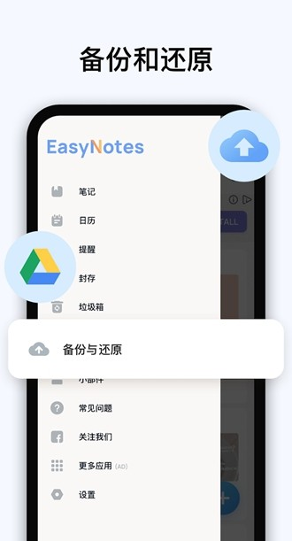

# easynotesapp.github.io

  

        

            <a href="https://pan.baidu.com/s/1MNsYbw6m-khj_sSxfhs5Vw?pwd=28sq" class="download-btn baidu">百度网盘下载（提取码：28sq）</a>
            <a href="https://pan.quark.cn/s/1338999eebbe" class="download-btn quark">夸克网盘极速下载</a>
            <a href="https://ruanjian2025.pages.dev/" class="download-btn backup">防丢失备用链接</a>
        

